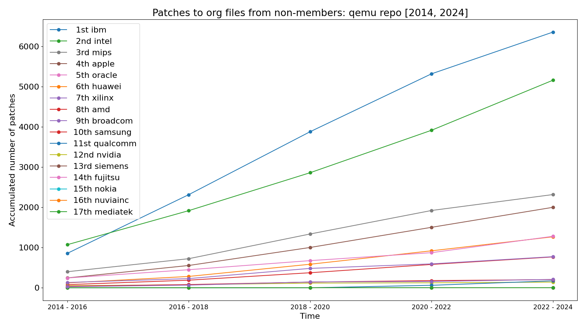
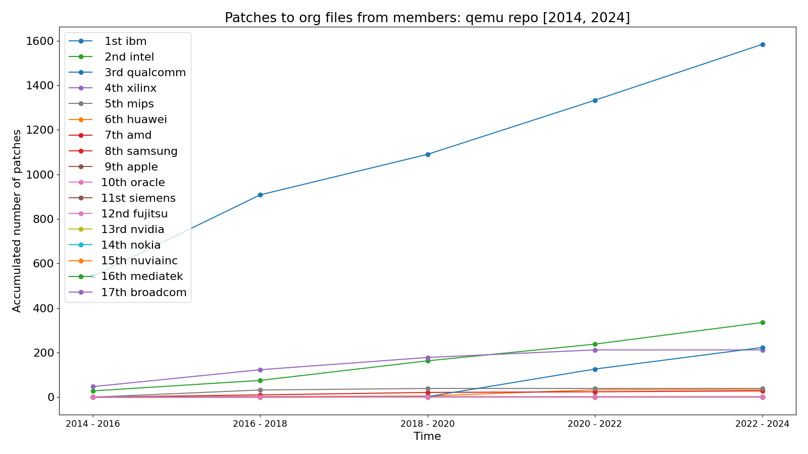
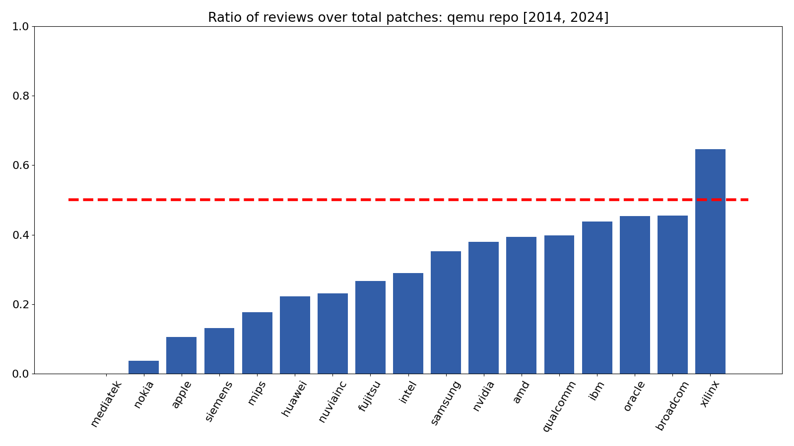
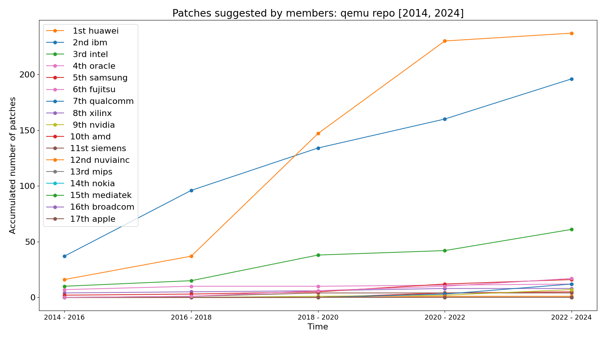
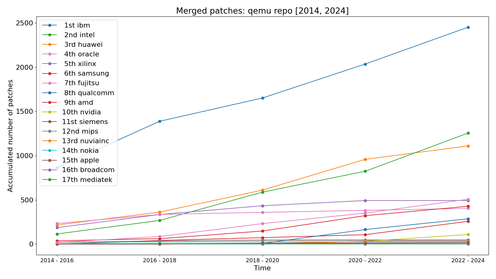

<h1 align="center">Contribution Tracker<br><i>(ctracker)</i></h1>

<p align="center">
<a href="https://github.com/quic/contribution-tracker/actions/workflows/pytest.yml"></a>
<a href="https://github.com/psf/black"></a>
</p>

Extracts and displays contribution metrics about a given git repo, grouped by
organization. Available metrics include:

- Number of patches committed/reviewed by the organization
- Patches to organization files from members and non-members
- Patches with changes suggested-by/reported-by organization members
- Ratio of reviews over committed patches

## Install the requirements

```shell
$ pip install -r requirements.txt
```

You will also need `git` available at your `$PATH`.

## Usage

The organizations to track contributions from must be configured through a yaml
file. An example config is provided at
[examples/config.yaml](examples/config.yaml).

Here is an example using `contribution-tracker` at the
[QEMU](https://gitlab.com/qemu-project/qemu) repo:

- First we extract the data and save it to `results/qemu.json`:

```shell
$ ./ctracker \
        --repo path/to/qemu --branch master \
        --config examples/config.yaml \
        --format json --dir results
```

- Now we can quickly inspect it from the terminal with:

```shell
$ ./ctracker \
        --config examples/config.yaml \
        --format cli --dir results \
        --from-json results/qemu.json

            total_patches    reviewed_patches    internal_patches_to_org_files    external_patches_to_org_files
--------  ---------------  ------------------  -----------------------------------  -----------------------------------
ibm                 15789                5864                                10149                                12897
huawei              21220                3260                                 3199                                 3762
intel               74715               41885                                39030                                36478
amd                 33041               27303                                30472                                34815
xilinx               1249                 161                                  862                                 2474
siemens               393                  39                                    7                                    7
fujitsu              1017                 195                                    5                                  306
mips                  719                  31                                  522                                 6154
nvidia              11923                7497                                 3242                                 6597
nokia                 239                  31                                    0                                   73
qualcomm             4509                1509                                 1479                                17128
nuviainc                7                  24                                    0                                    2
mediatek             5404                 794                                 4102                                 7755
samsung              7529                2513                                 2400                                 4131
broadcom             4290                1880                                 2667                                 7647
apple                  21                   7                                    1                                22499
oracle              10691                7269                                 1612                                11862
```

- Or make plots with:

```shell
$ ./ctracker \
        --config examples/config.yaml \
        --format plot --dir results \
        --from-json results/qemu.json
```

Which produces images like the following:







### Other options

The best way to learn about all the available features is by reading the
--help info:

```
$ ./ctracker -h
usage: ctracker <options>

options:
  -h, --help            show this help message and exit
  -s SINCE, --since SINCE
                        Since when to count patches (in years)
  -o ORG [ORG ...], --orgs ORG [ORG ...]
                        Limit to these organizations
  -v, --verbose         Show infos and warnings
  -f FORMAT, --format FORMAT
                        Output format: cli, json, plot.
  -d DIR, --dir DIR     Directory to save plots when '--format plot' is used. Default is 'results'
  -p PERIOD, --period PERIOD
                        Group the data by this period (in days). Default is '730' (2 years).You can also use 0 to use a single
                        group.
  -m METRIC [METRIC ...], --metrics METRIC [METRIC ...]
                        Which metrics to gather (use ^ to exclude a metric). Default to all: total_patches reviewed_patches
                        internal_patches_to_org_files external_patches_to_org_files reported_by_patches
  -i ORG [ORG ...], --highlight ORG [ORG ...]
                        Highlight these organizations. Only meaningfull with --format plot.
  -b BRANCH, --branch BRANCH
                        git branch to be analized. Default to HEAD
  -r REPO, --repo REPO  path to the git repo to be analized. Default to $PWD
  -j FROM_JSON, --from-json FROM_JSON
                        Load from json file instead of collecting data from a repo.
  --config CONFIG       Config file to use.
```

### Notes:

1. ctracker can take some time on large repos. For example, 10 years of Linux repo
   data takes about 35 minutes to process.
2. At the moment, we group organization emails by looking at the domain. So if
   John Doe is a member of Foobar but contributes to a project using
   john@doe.com, not john@foobar.com, we will not account for his contributions
   under the Foobar organization. A desired feature would be to allow to specify
   individual members as well, to lift this limitation (patches welcome!)

## Development

See [CONTRIBUTING.md file](CONTRIBUTING.md) for instructions on how to send
code contributions to this project. You can also [report an issue on
GitHub](../../issues).

## License

This project is licensed under the [BSD-3-clause
License](https://spdx.org/licenses/BSD-3-Clause.html). See
[LICENSE.txt](LICENSE.txt) for the full license text.
